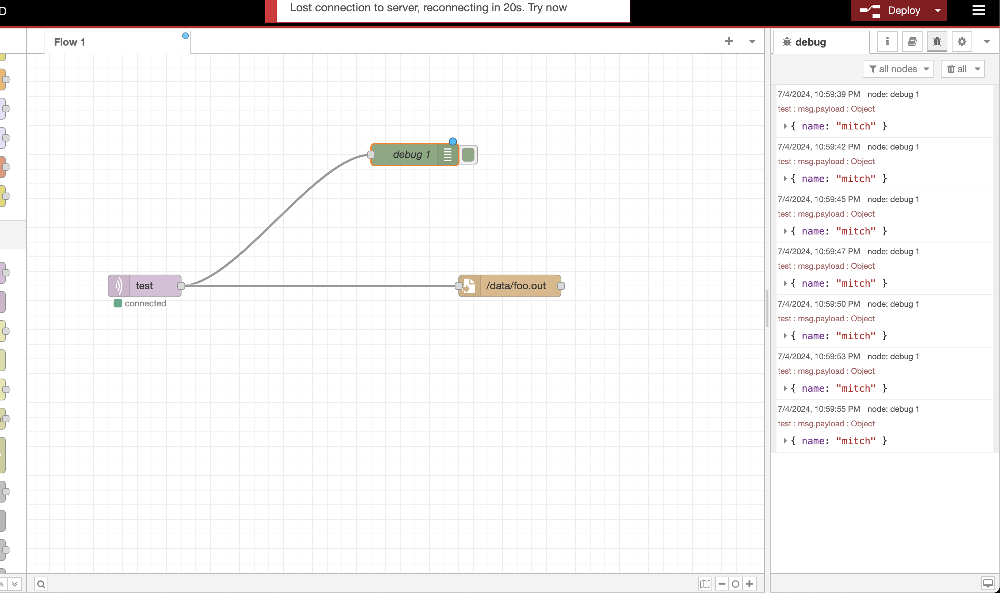
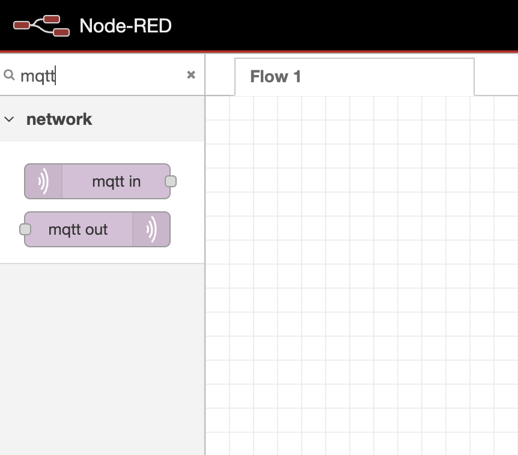
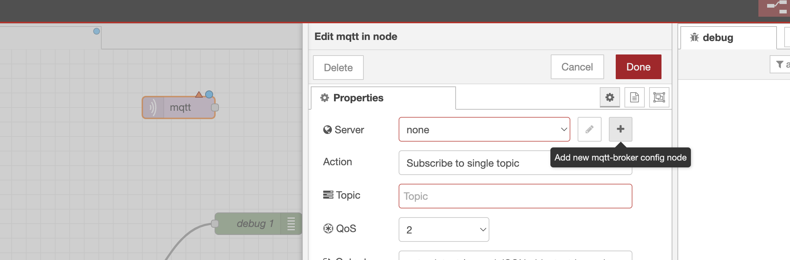
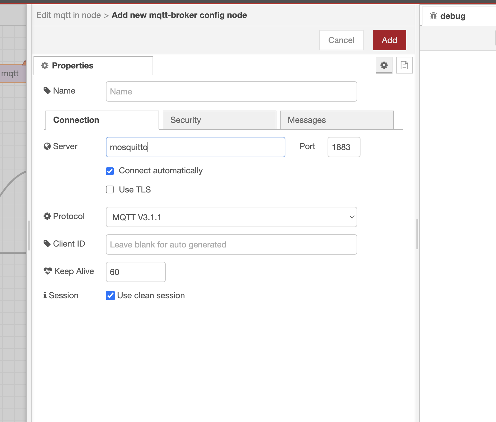
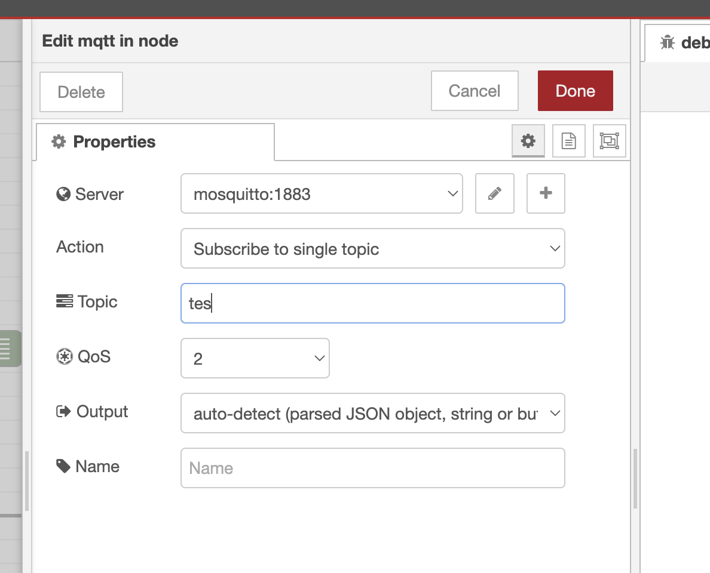
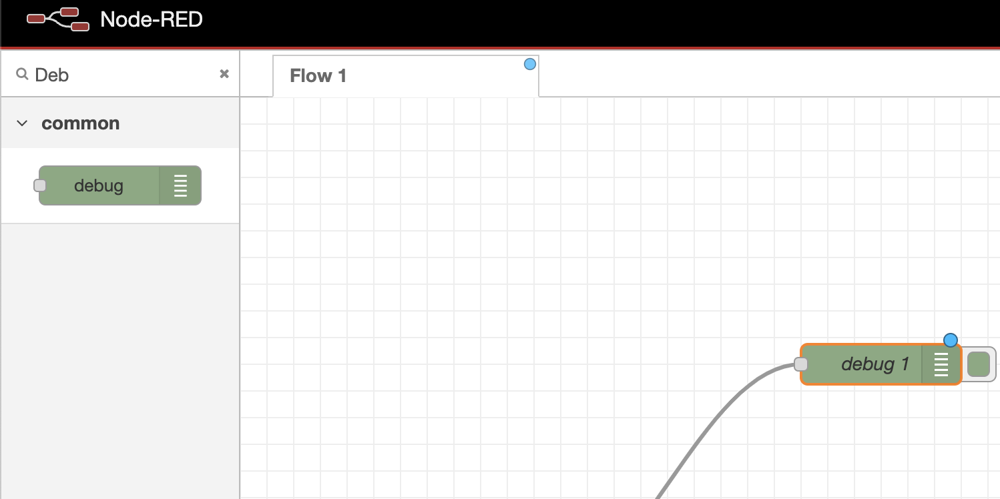
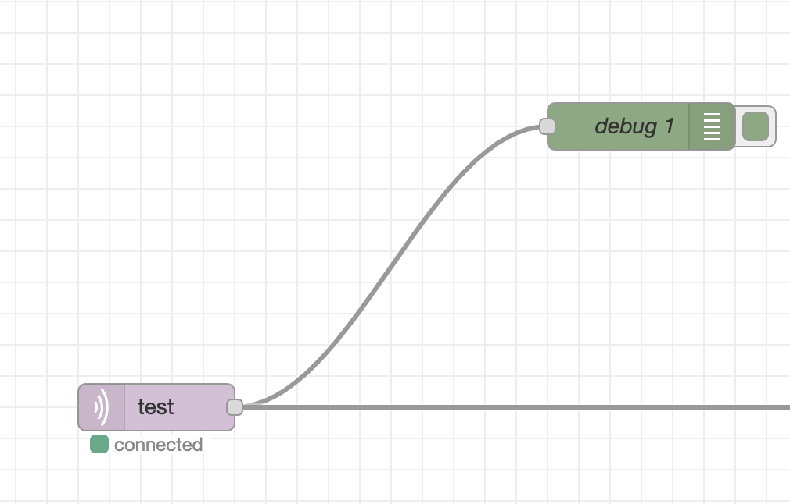
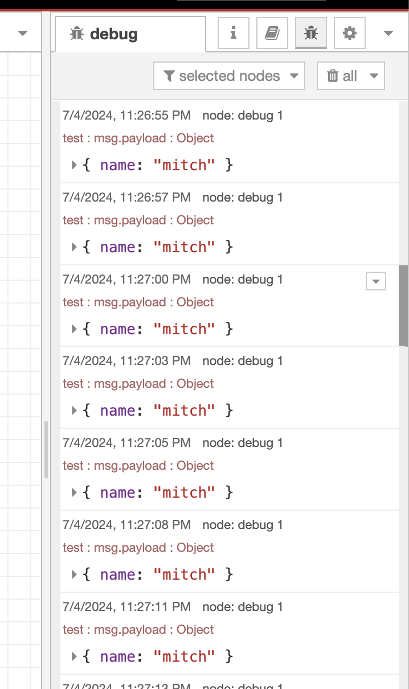

# mqtt-playground
Testing MQTT broker and NodeRed

## Running the playground
1. Run `docker compose up -d`
2. Nodered can be accessed locally from docker compose by navigatting to `http://localhost:1880/` in a browser.

## Creating a flow

### Add an MQTT node
Search for an MQTT in node and drag the node into the flow.

Double click the MQTT in node to open properties.

Click the `+` icon to create a new MQTT server configration. Enter `mosquitto` and click `Add`

This brings you back to the node properties. 
- Ensure `mosquitto:1883` is the selected server. 
- Then add the topic `tests`
- CLick Done

### Add Debug node
Search for the debug node and drag it into the flow.

Add a connection from the MQTT in node to the Debug node

## Running the flow
Run the flow by clicking the `Deploy` button in the top left corner of the browser window.

## Debugging the flow
1. Select the debug icon under the `Deploy button`
2. Run the following simple script to publish an MQTT message every two seconds:   `while true; do mqtt pub -t test -m '{"name": "mitch"}' ; sleep 2; done`
3. The debug mviewodal in the browser should show display each of the published messages:

## Resources

**MQTT CLI** - CLI for publishing messages to an MQTT broker. 
- [Documentation](https://hivemq.github.io/mqtt-cli/docs/quick-start/)
- Install via `brew install hivemq/mqtt-cli/mqtt-cli`

**MQTT/Kafka comparison** 
- [Documentation](https://www.hivemq.com/blog/mqtt-vs-kafka-real-time-bidirectional-data-processing/)

**NodeRed** Browser based event flow editor. 
- [Website](https://nodered.org/)
- Nodered can be accessed locally from docker compose by navigatting to `http://localhost:1880/` in a browser.

